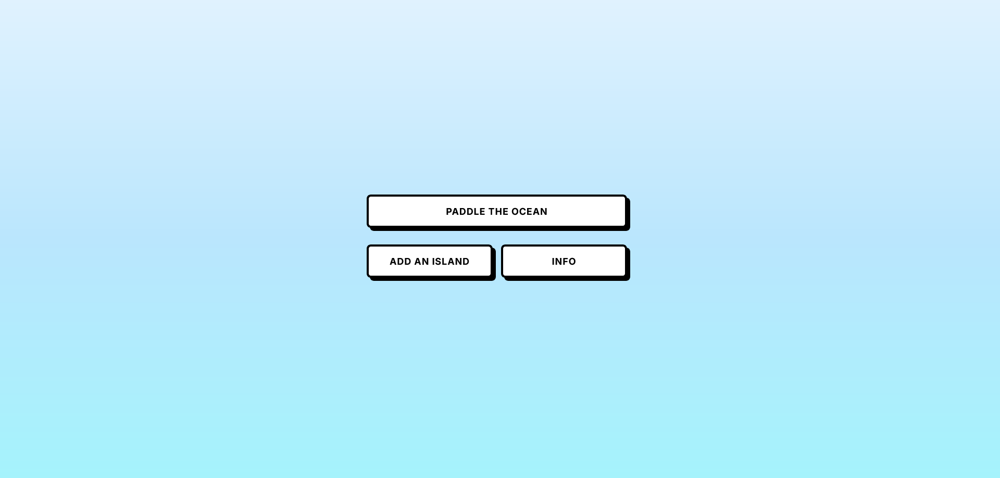
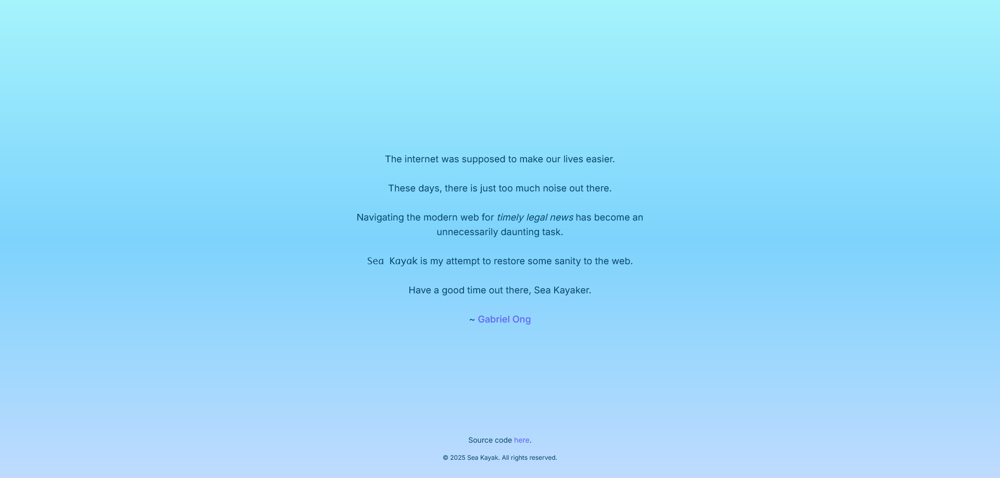

 

# `Sea Kayak`

A Web App that serves you one piece of [Singaporean Legal News](#coverage) a day.

    

## Rationale

Navigating the Modern Internet feels like trudging through miles of swamp searching for a milligram of gold.  

Judging from [these articles](#other-notes), I'm not the only one who feels this way.

With this frustration nagging at me, I created `Sea Kayak` to make it easier to find ***timely Singaporean Legal News***.

## Screenshots

  
  

## Usage

Use the live website [**here**](https://sea-kayak.vercel.app/).

[RSS Feeds](#coverage) are scraped daily at [SGT 12am](#architecture).

> [!IMPORTANT]
> Read the [legal disclaimer](#legal-disclaimer) before using `Sea Kayak`.

## Stack

* *Frontend*: [React](https://react.dev/), [Next.js](https://nextjs.org/), [Vercel](https://vercel.com/)
* *Backend*: [Python](https://www.python.org/), [Github Actions](https://github.com/features/actions)
* *Package*: [Docker](https://www.docker.com/)

## Coverage

`Sea Kayak` currently [scrapes](./.github/workflows/collate.yml) the following sources [daily](#architecture).

[**Open an issue**](https://github.com/gongahkia/sea-kayak/issues) to have a source added.

### Remote RSS Feeds

* [singaporelawwatch.sg/Portals/0/RSS/](https://www.singaporelawwatch.sg/Portals/0/RSS/SuperFeed)
    * [singaporelawwatch.sg/Portals/0/RSS/Headlines.xml](https://www.singaporelawwatch.sg/Portals/0/RSS/Headlines.xml)
    * [singaporelawwatch.sg/Portals/0/RSS/Judgments.xml](https://www.singaporelawwatch.sg/Portals/0/RSS/Judgments.xml)
    * [singaporelawwatch.sg/Portals/0/RSS/Commentaries.xml](https://www.singaporelawwatch.sg/Portals/0/RSS/Commentaries.xml)
    * [singaporelawwatch.sg/Portals/0/RSS/Notices.xml](https://www.singaporelawwatch.sg/Portals/0/RSS/Notices.xml)
    * [singaporelawwatch.sg/Results/rss/category/426/continuing-legal-education](https://www.singaporelawwatch.sg/Results/rss/category/426/continuing-legal-education)
    * [singaporelawwatch.sg/Results/rss/category/426/judgments-1](https://www.singaporelawwatch.sg/Results/rss/category/426/judgments-1)
    * [singaporelawwatch.sg/Results/rss/category/426/notices-and-directions](https://www.singaporelawwatch.sg/Results/rss/category/426/notices-and-directions)
    * [singaporelawwatch.sg/Results/rss/category/426/commentaries](https://www.singaporelawwatch.sg/Results/rss/category/426/commentaries)
* [sso.agc.gov.sg/RSS/](https://sso.agc.gov.sg/RSS/NewLegislation.aspx)
* [mlaw.gov.sg/feed.xml](https://www.mlaw.gov.sg/feed.xml)
* [blog.nus.edu.sg/lawresearch/feed/](https://blog.nus.edu.sg/lawresearch/feed/)
* [singaporeinternationalarbitration.wordpress.com/feed/](https://singaporeinternationalarbitration.wordpress.com/feed/)
* [lawgazette.com.sg/feed/](https://lawgazette.com.sg/feed/)
* [lawgazette.com.sg/category/notices/disciplinary-tribunal-reports/feed/](https://lawgazette.com.sg/category/notices/disciplinary-tribunal-reports/feed/)
* [hungryhippo.huey.xyz/individual-site/academypublishing.org.sg/sal-practitioner/?area=Advocacy-and-Procedure](https://hungryhippo.huey.xyz/individual-site/academypublishing.org.sg/sal-practitioner/?area=Advocacy-and-Procedure)
* [hungryhippo.huey.xyz/individual-site/academypublishing.org.sg/sal-practitioner/?area=Construction-and-Infrastructure](https://hungryhippo.huey.xyz/individual-site/academypublishing.org.sg/sal-practitioner/?area=Construction-and-Infrastructure)
* [hungryhippo.huey.xyz/individual-site/academypublishing.org.sg/sal-practitioner/?area=Corporate](https://hungryhippo.huey.xyz/individual-site/academypublishing.org.sg/sal-practitioner/?area=Corporate)
* [hungryhippo.huey.xyz/individual-site/academypublishing.org.sg/sal-practitioner/?area=Crime](https://hungryhippo.huey.xyz/individual-site/academypublishing.org.sg/sal-practitioner/?area=Crime)
* [hungryhippo.huey.xyz/individual-site/academypublishing.org.sg/sal-practitioner/?area=Employment-Law](https://hungryhippo.huey.xyz/individual-site/academypublishing.org.sg/sal-practitioner/?area=Employment-Law)
* [hungryhippo.huey.xyz/individual-site/academypublishing.org.sg/sal-practitioner/?area=Family-and-Personal-Law](https://hungryhippo.huey.xyz/individual-site/academypublishing.org.sg/sal-practitioner/?area=Family-and-Personal-Law)
* [hungryhippo.huey.xyz/individual-site/academypublishing.org.sg/sal-practitioner/?area=Fintech](https://hungryhippo.huey.xyz/individual-site/academypublishing.org.sg/sal-practitioner/?area=Fintech)
* [hungryhippo.huey.xyz/individual-site/academypublishing.org.sg/sal-practitioner/?area=Insolvency-and-Restructuring](https://hungryhippo.huey.xyz/individual-site/academypublishing.org.sg/sal-practitioner/?area=Insolvency-and-Restructuring)
* [hungryhippo.huey.xyz/individual-site/academypublishing.org.sg/sal-practitioner/?area=Transportation](https://hungryhippo.huey.xyz/individual-site/academypublishing.org.sg/sal-practitioner/?area=Transportation)
* [hungryhippo.huey.xyz/individual-site/academypublishing.org.sg/sal-journal](https://hungryhippo.huey.xyz/individual-site/academypublishing.org.sg/sal-journal)
* [hungryhippo.huey.xyz/individual-site/law.nus.edu.sg/trail](https://hungryhippo.huey.xyz/individual-site/law.nus.edu.sg/trail)
* [lexology.com/email/rss.aspx?tagType=5&tagRef=155&tagTitle=%20Singapore&extrajr=&extrawr=](https://www.lexology.com/email/rss.aspx?tagType=5&tagRef=155&tagTitle=%20Singapore&extrajr=&extrawr=)

### Local RSS Feeds

* [lawgazette.com.sg/feed](https://lawgazette.com.sg/feed)
* [singaporeinternationalarbitration.com/feed](https://singaporeinternationalarbitration.com/feed)

## Architecture

## Issues

Report any issues to [gabrielzmong@gmail.com](mailto:gabrielzmong@gmail.com).

## Reference

The name `Sea Kayak` is in reference to the [sea kayak](https://en.wikipedia.org/wiki/Sea_kayak), a type of [kayak](https://en.wikipedia.org/wiki/Kayak) designed for [paddling](https://en.wikipedia.org/wiki/Paddling) over large bodies of water. Specifically, the name for this project came to me after watching [Beau Miles](https://www.youtube.com/@BeauMiles)' 2017 6-part series [Bass by Kayak](https://youtube.com/playlist?list=PLXoBa_nJj5lWtT6DsttZ5le3LxlnrBkjm&feature=shared).

## Other notes

`Sea Kayak` takes inspiration from [The Forest](https://theforest.link/) and [HungryHippo](https://github.com/hueyy/HungryHippo).

The below articles also validated my confirmation bias and fuelled me to complete `Sea Kayak`.

* [*The modern web is becoming unusable*](https://news.ycombinator.com/item?id=21848468)
* [*The internet is unusable now*](https://www.newstatesman.com/thestaggers/2023/06/internet-is-unusable-now-google-technology)
* [*Why Is the Web So Monotonous?*](https://reasonablypolymorphic.com/blog/monotonous-web/)
* [*Today’s Internet is Optimized for Noise*](https://medium.com/@sidewire/today-s-internet-is-optimized-for-noise-88e8072ff476)

## Legal Disclaimer

### For Informational Purposes Only

The information provided on Sea Kayak is for general informational purposes only. While we strive to ensure the accuracy and reliability of the legal news sites displayed, Sea Kayak makes no guarantees, representations, or warranties of any kind, express or implied, about the completeness, accuracy, reliability, suitability, or availability of the information. Users should independently verify any information before making decisions based on it.

### No Professional Advice

Sea Kayak does not provide professional legal advice or consultation services. The legal news sites recommended should not be considered as a substitute for professional advice from qualified legal practitioners or attorneys. Users are encouraged to consult with appropriate legal professionals regarding their specific legal matters and requirements.

### No Endorsement

The inclusion of any legal news sites or reference to any websites on Sea Kayak does not constitute an endorsement or recommendation of those sites or their content. Sea Kayak is not affiliated with any of the original content providers unless explicitly stated otherwise.

### Third-Party Content

Sea Kayak displays information sourced from third-party providers and websites. We do not control, monitor, or guarantee the accuracy or reliability of such third-party content. The legal news sites and related information are derived from publicly available sources, and Sea Kayak does not claim ownership of this content. Using information obtained from these sources is at your own risk, and Sea Kayak is not responsible for any content, claims, or damages resulting from their use.

### Use at Your Own Risk

Users access, use, and rely on legal news sites recommended by Sea Kayak at their own risk. Legal information may become outdated or inaccurate without notice, and legal landscapes may change rapidly. Sea Kayak disclaims all liability for any loss, injury, or damage, direct or indirect, arising from reliance on the information provided on this platform. This includes but is not limited to legal misinformation, outdated legal precedents, incorrect interpretations, or decisions made based on the content displayed.

### Limitation of Liability

To the fullest extent permitted by law:

* Sea Kayak shall not be liable for any direct, indirect, incidental, consequential, or punitive damages arising out of your use of this web app or reliance on any legal news sites recommended by it.
* Sea Kayak disclaims all liability for errors or omissions in the content provided.
* Our total liability under any circumstances shall not exceed the amount paid by you (if any) for using Sea Kayak.

### User Responsibility

Users are solely responsible for:

* Verifying the accuracy and currency of any legal information obtained through recommended sites.
* Seeking appropriate professional legal advice for their specific circumstances.
* Complying with all applicable laws, regulations, and professional conduct rules.
* Understanding that legal news and commentary are not substitutes for formal legal counsel.
* Exercising independent judgment when interpreting legal information and developments.

### Copyright and Intellectual Property

Sea Kayak respects intellectual property rights and makes efforts to only display publicly available information. If you believe your copyrighted work has been inappropriately scraped or displayed on Sea Kayak, please contact us to request its removal.

### Data Collection and Privacy

Sea Kayak may collect user data to improve service functionality. By using Sea Kayak, you consent to our data collection practices as outlined in our separate Privacy Policy.

### Changes to Content

Sea Kayak reserves the right to modify, update, or remove any content on this platform at any time without prior notice. Legal news sites and recommendations may change without notice due to various factors including changes in site availability, content quality assessments, or updates to source websites.

### Jurisdiction

This disclaimer and your use of Sea Kayak shall be governed by and construed in accordance with the laws of Singapore. Any disputes arising out of or in connection with this disclaimer shall be subject to the exclusive jurisdiction of the courts in Singapore.